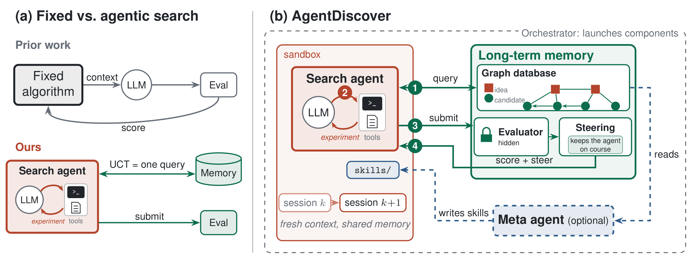

# AgentDiscover

**Autonomous Discovery with Minimal Search Scaffolding**

[**Project page**](https://mhdfb.github.io/AgentDiscover/) · Paper (arXiv, coming soon) · [BibTeX](https://mhdfb.github.io/AgentDiscover/#bibtex)

Coding agents search for better solutions to open problems. Each agent writes code, gets
it scored, and learns from what everyone tried before — all recorded in a graph database.



Prior frameworks run a fixed, human-designed search in which the model only proposes
programs. AgentDiscover makes the coding agent the planner: it decides what to retrieve
from the graph database, which experiments to run, and when to submit. On Anthropic's
kernel builder task, seven past AtCoder heuristic contests, and eleven mathematical and
systems optimization tasks, it reaches better scores at lower model spend than existing
discovery frameworks. Results and details are on the
[project page](https://mhdfb.github.io/AgentDiscover/).

You need **git**, **curl**, and **one container runtime**: `docker`, `podman`,
`apptainer`, `singularity`, or `enroot`. Nothing else — Python and the agent CLIs are
installed for you.

---

## Setup

**1. Install.**

```bash
./script/setup
```

Prints `[ok]` per item. Fix anything that says `[missing]` and run it again.

**2. Set a database password.**

```bash
cp .env.example .env
```

Open `.env` and put any string in `NEO4J_PASSWORD`. You never type it again.

**3. Log in to Claude.**

```bash
claude login
```

Or put `ANTHROPIC_API_KEY=sk-ant-...` in `.env` instead.

---

## Run

```bash
./run.sh
```

That's it. By default: problem `labs`, one Haiku agent, 1 round, 2 solutions. A few
minutes.

See what happened:

```bash
tail runs/labs/run.log
```

```
[you/researcher-a/1] candidates=2 best=0.41 retrieved=0 read=0 status=ok
```

`best` is the score — higher is always better. The agent's workspace, transcript and the
database are all under `runs/labs/`.

Stop a run cleanly with `touch runs/labs/STOP`. Avoid Ctrl-C — it can interrupt a
database write.

---

## Bigger runs

Copy `examples/slurm.sh` (or `examples/slurm-gpu.sh` for a GPU problem), adjust the
SBATCH header for your cluster and the settings at the top
(problem, agents, iterations — every knob is listed in `run.sh`), then `sbatch` it.
Don't edit `run.sh` itself.

Re-running a problem **continues** where it stopped. To start over, delete
`runs/<problem>/`.
